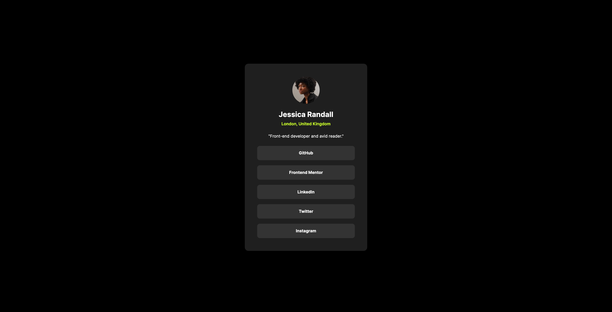
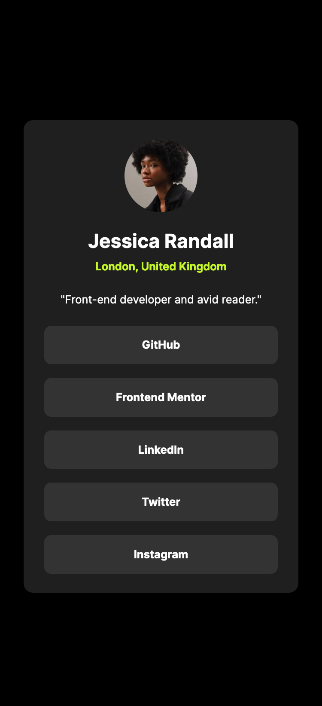

# Frontend Mentor - Social links profile solution

This is my solution to the [Social links profile challenge on Frontend Mentor](https://www.frontendmentor.io/challenges/social-links-profile-UG32l9m6dQ). Frontend Mentor challenges help you improve your coding skills by building realistic projects. 

## Table of contents
  - [The challenge](#the-challenge)
  - [Screenshot](#screenshot)
  - [Links](#links)
  - [Built with](#built-with)
  - [Useful resources](#useful-resources)
- [Author](#author)

### The challenge

Users should be able to:

- See hover and focus states for all interactive elements on the page

### Screenshot

 

### Links

- Solution URL: (https://github.com/chaeh8n/social-links-profile-main)
- Live Site URL: [live site URL](https://chaeh8n.github.io/social-links-profile-main/index.html)

### Built with

- HTML
- Flexbox
- CSS 
- Mobile-first workflow

### Useful resources

- [Responsive Design](https://fedmentor.dev/posts/responsive-meaning/) 
- [CSS reset](https://piccalil.li/blog/a-more-modern-css-reset/)

## Author

- Github - [Chaehoon Lee](https://github.com/chaeh8n)
- Frontend Mentor - [@Chaeh8n](https://www.frontendmentor.io/profile/Chaeh8n)
